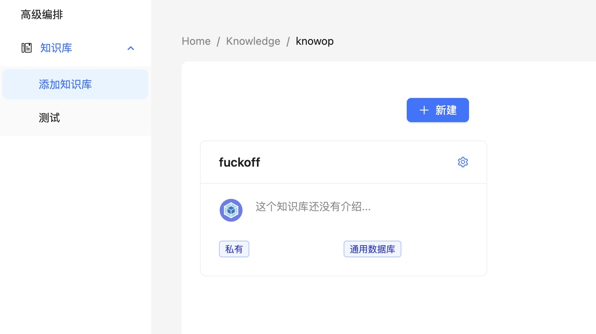

# 整体内容持续更新，进群提要求，按需更新

微信

    
    

### 收费标准
- 使用自有API KEY 不收费
- 域名绑定授权 1一个域名 499 永久免费更新，客户通过你的域名访问
- 授权独立部署 支付Server费用 + 100元初装费用（Server费用官方定价，需在指定渠道购买）
    - 独立部署更新，每次更新收取100服务费，也可多版本合并更新也只收取100
